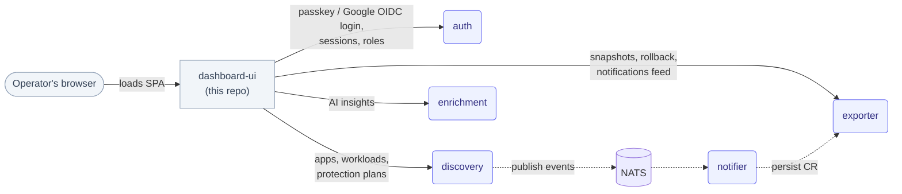

# dashboard-ui

The operator-facing dashboard for **telark**, a protection gate for Kubernetes workloads. This repo is the React/TypeScript single-page app only — it has no backend logic of its own and does nothing without the telark services running behind it.

## What is dashboard-ui?

dashboard-ui is a Vite + React 19 + TypeScript SPA (Redux Toolkit for state, Ant Design for components) that lets an operator log in, browse discovered applications and their workloads, inspect and roll back snapshots, manage protection plans, and administer users/groups/roles. It talks to the telark backend services over REST and renders what they return; it holds no cluster state itself. The backend — Go microservices plus a Python enrichment service — lives in the sibling [`telark`](https://github.com/telark/telark) repo, deployed as one Helm chart. Building/publishing the image and the chart is also owned by that repo (see [Building & Releasing](#building--releasing) below).

## Architecture

dashboard-ui is one node in the telark system: a static SPA that calls the backend services directly over HTTP. It never talks to Kubernetes, Redis, or NATS itself — that's the services' job.

Real service names, as referenced in `src/api/health/constants.ts`, `src/api/types/registry.ts`, and `src/constants/rest/api.ts` (`ServiceName = 'exporter' | 'discovery' | 'auth' | 'enrichment'`):

| Service | Language | What the UI uses it for |
|---|---|---|
| `auth` | Go | Login (passkey + Google OIDC), session/refresh, roles & permissions |
| `discovery` | Go | Applications, workloads, protection plans |
| `exporter` | Go | Snapshots/rollback, notifications feed (the only stateful backend service) |
| `enrichment` | Python/FastAPI | AI insights on applications |
| `notifier` | Go | Not called by the UI directly — it persists notification CRs into `exporter`, which the UI then reads |



**Auth flow** (`src/features/auth`): the UI supports two login paths against the `auth` service — WebAuthn/passkey (`clients/passkeys.ts`, `utils/webauthn/*`) and Google OIDC (`clients/login.ts`: `oidcGetNonce` then `oidcGoogleCallback`). A successful login returns a session (`clients/session.ts`, `utils/session/*`) and a permission set (`clients/permissions.ts`) that the rest of the app reads to gate routes and actions.

**Reaching the backend**: there is no Vite dev proxy. `src/constants/rest/urls.ts` builds each service's base URL from a compile-time `__IN_CLUSTER__` flag:
- In local dev (`__IN_CLUSTER__` is `false`), it targets `http://localhost:<port>` directly using fixed dev ports (`DEV_API_PORTS`: exporter `8002`, discovery `8004`, auth `8006`, enrichment `8007`).
- In a cluster build (`__IN_CLUSTER__` is `true`, set by `vite build --mode cluster`), it targets `/api/<service>/...` behind the ingress instead.

## Local development setup

```sh
npm install
npm run dev              # BROWSER='Google Chrome' vite --port 3000 --open
```

`npm run dev` alone won't do anything useful — the app calls real services on `localhost:8002/8004/8006/8007` (see Architecture above), so you need `exporter`, `discovery`, `auth`, and `enrichment` from the [`telark`](https://github.com/telark/telark) repo running locally (or port-forwarded to those exact ports) before the UI can log in or load data. There is no `.env`/proxy config to edit — the ports are the fixed constants in `src/constants/rest/urls.ts`.

Other scripts (`package.json`):

| Script | Command | Purpose |
|---|---|---|
| `npm run build` | `npm run generate:licenses && vite build` | Standalone/local production build |
| `npm run build:cluster` | `npm run generate:licenses && vite build --mode cluster` | In-cluster build (used by the Dockerfile) |
| `npm run build:analyze` | `npm run generate:licenses && vite build --mode analyze` | Production build with a bundle-size report |
| `npm run serve` | `vite preview` | Preview a production build locally |
| `npm run lint` / `npm run lint:f` | `eslint .` / `eslint . --fix` | Lint (with/without autofix) |
| `npm run format` | `prettier --write .` | Format the codebase |
| `npm run type-check` | `tsc --noEmit` | TypeScript check, no emit |
| `npm run check-all` | `npm run type-check && npm run lint` | **Run this before opening a PR** |
| `npm run check-all-and-build` | `npm run type-check && npm run lint && npm run build` | What the telark build pipeline runs against this repo |

Verify your setup with `npm run check-all` — not `npm run build`, which only proves the bundle compiles, not that types and lint are clean.

## Project conventions

**Code style** (enforced by `eslint.config.mjs`, an ESLint v9 flat config):
- `@typescript-eslint/no-explicit-any`: warn — don't add new `any`s.
- `no-console`: error everywhere except `src/logging/**` (the logger itself) and `k6/**` (load-test scripts) — use the project logger, never `console.*`.
- `prettier/prettier`: warn, plus `eslint-config-prettier`/`eslint-plugin-prettier` so formatting is enforced through lint.
- React/React Hooks recommended rules apply; `react/react-in-jsx-scope` and `react/prop-types` are off (new JSX transform, TypeScript types instead of prop-types).
- Constants are centralized, not inlined: shared ones live under `src/constants/{rest,layout,shared,store,pages}`, and each feature keeps its own `constants/` folder (e.g. `src/features/auth/constants`, `src/features/notifications/constants`).

**Branching**: `<type>/<snake_case_description>`, e.g. `feat/add_auth_layer_using_webauthn`, `bug-fix/fix_apps_and_plans_bugs`, `refac/re_structure_into_features_single_link_folders`, `migrate/upgarde_to_antd_6.3.7`, `poc/integrate_vite`. Common types seen in history: `feat`, `bug-fix`, `refac`/`refacto`, `migrate`/`migration`, `poc`, `upd`.

**Commits**: short, imperative, present tense (`remove GlobalConfig Fetch on login`, `fix loading state across pages to avoid multi loaders display`). Not Conventional Commits — no enforced `feat:`/`fix:` prefix. Large multi-area commits are sometimes tagged, e.g. `[Major]: ...`, `[GAF]: ...`.

**PR checklist**: this repo has no `.github/workflows` of its own — there's no automatic per-PR CI here. The only automated check that touches this code is the `gate-ui` job in telark's [`build-ui.yaml`](../Github/telark/.github/workflows/build-ui.yaml) workflow, which — when someone builds a UI image — checks out this repo and runs `npm ci` then `npm run check-all-and-build`. Since that only runs on demand, run it yourself before opening a PR:
- [ ] `npm run check-all` passes (type-check + lint)
- [ ] `npm run build` succeeds
- [ ] Manually exercised the change against real backend services (see Local development setup)
- [ ] No new `any`, no `console.*`, no inlined literals that belong in `constants/`

## Building & Releasing

**Image builds and Helm chart releases are not managed in this repo.** They're owned by the [`telark`](https://github.com/telark/telark) repo:

- [`telark/.github/workflows/build-ui.yaml`](../Github/telark/.github/workflows/build-ui.yaml) ("Build · UI Image") checks out this repo at a given branch (default `master`), runs the `gate-ui` job (`npm run check-all-and-build`), then builds and pushes the image from this repo's [`Dockerfile`](./Dockerfile) (`node:24-alpine3.23` build stage → nginx serve stage), bumps the version, and cosign-signs it.
- [`telark/.github/workflows/release-charts.yaml`](../Github/telark/.github/workflows/release-charts.yaml) ("Release · Publish Charts") packages, pushes, and signs the `telark` and `telark-crds` Helm charts to `oci://ghcr.io/telark/charts`.
- [`telark/docs/PUBLISHING.md`](../Github/telark/docs/PUBLISHING.md) documents the manual publish path for testing a chart/image release by hand.

This repo's own `Dockerfile` only defines how the image is built; it is invoked by the telark workflow above, not by anything in this repo.

(Paths above are relative to a sibling checkout — `dashboard-ui/` and `telark/` side by side. If you don't have `telark` checked out locally, the same files are at `https://github.com/telark/telark/blob/main/.github/workflows/build-ui.yaml` etc.)

## Readiness / Production docs

Installation, sizing, and verification for the full telark system (this UI included) live in the `telark` repo, not here:

- [`telark/docs/INSTALL.md`](../Github/telark/docs/INSTALL.md) — prerequisites, install-time flags, sizing modes, and the `helm test` / `kubectl get pods` verification steps.
- [`telark/docs/architecture.md`](../Github/telark/docs/architecture.md) — full system architecture, service responsibilities, and data flow (the diagram above is a UI-centric excerpt of this).
- [`telark/docs/CRDS.md`](../Github/telark/docs/CRDS.md) — the CRD groups/kinds the backend services expose, which show up as data in this UI.
- [`telark/docs/adr/`](../Github/telark/docs/adr/) — architecture decision records.

I looked for a dedicated production-readiness/operations runbook in the `telark` repo and didn't find one beyond `INSTALL.md`'s verification steps — flagging that as a gap rather than inventing a path.
