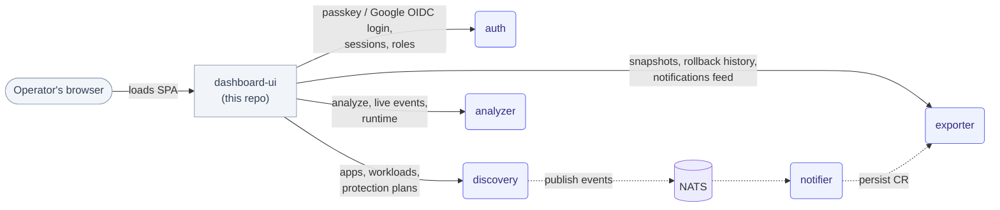

# dashboard-ui

The web dashboard of [Telark](https://github.com/telark/telark), a protection gate for your Kubernetes applications. It is where operators see their applications, run protection plans, read Insights, and manage access.

This repository holds the dashboard SPA only. The services it calls, the Helm chart, the CRDs and the product docs live in [telark/telark](https://github.com/telark/telark), and the docs are published at [docs.telark.io](https://docs.telark.io). To run Telark, follow the [getting started guide](https://github.com/telark/telark/blob/main/docs/getting-started.md).

## What is in the dashboard

| Area | What operators do there |
|---|---|
| Applications | Browse discovered applications and their workloads, the plans that cover them, change history and rollback, and Insights for each app |
| Protection plans | Create, schedule, approve, cancel, and reactivate plans; see health, violations, and reports; organize environments and tags |
| Insights | Incident cards and setup recommendations, updated live |
| Administration | Members, groups, and access roles |
| Settings | Profile, appearance, security, authentication (Google SSO and self-registration), Insights and the local AI runtime, discovery scope and snapshot storage |

Every action is gated by the signed-in user's permissions, including deny rules. The backend enforces the same checks.

**Stack:** React 19, TypeScript 6, Vite 8, Redux Toolkit, Ant Design 6.

## How it talks to Telark

The dashboard never talks to Kubernetes, Redis or NATS directly. It calls four Telark services over HTTP:

| Service | Local port | Used for |
|---|--:|---|
| `auth` | `8006` | Passkey and Google sign-in, sessions, and permissions |
| `discovery` | `8004` | Applications, workloads, protection-plan actions, and Insights reads |
| `exporter` | `8002` | Stored resources, snapshots, rollback history, notifications, categories, and reports |
| `analyzer` | `8007` | Analysis, live Insights events, AI runtime status, and model installation |



A cluster build (`vite build --mode cluster`) calls `/api/<service>/api/v1/...` on its own origin, and the bundled nginx proxies those paths to the services. In development, the app calls `http://localhost:<port>` directly. Service URLs are set in `src/constants/rest/urls.ts`.

## Develop

You need Node.js 26 and a Telark install whose API services allow the `http://localhost:3000` origin ([CORS](https://github.com/telark/telark/blob/main/docs/INSTALL.md#cors)). Forward the services to the ports above:

```sh
kubectl port-forward -n telark svc/telark-exporter-service 8002:8080 &
kubectl port-forward -n telark svc/telark-discovery-service 8004:8080 &
kubectl port-forward -n telark svc/telark-auth-service 8006:8080 &
kubectl port-forward -n telark svc/telark-analyzer-service 8007:8080 &
```

Then, in this repository:

```sh
npm install
npm run dev          # http://localhost:3000
```

| Script                        | Purpose                                       |
| ----------------------------- | --------------------------------------------- |
| `npm run build`               | Production build                              |
| `npm run build:cluster`       | In-cluster build used by the Docker image     |
| `npm run build:analyze`       | Build with a bundle-size report               |
| `npm run serve`               | Preview a build                               |
| `npm run lint:f`              | Autofix lint issues                           |
| `npm run format`              | Format the codebase                           |
| `npm run check-all`           | Type-check and lint                           |
| `npm run check-all-and-build` | Full validation used by the UI build pipeline |

### Code conventions

`eslint.config.mjs` enforces these. The full rules are in [`AGENTS.md`](./AGENTS.md).

* No `console.*` outside `src/logging/**`. Use the project logger.
* Constants belong in `src/constants/**` or a feature's `constants/` folder, not inline.
* Colors come only from `DEFAULT_COLORS` in `src/constants/shared/colors.ts`. Color literals elsewhere fail lint.
* No new `any` types.

## Build and release

This repository has no CI of its own. Images and Helm charts are built and released from the [Telark](https://github.com/telark/telark) repository:

* [`build-ui.yaml`](https://github.com/telark/telark/blob/main/.github/workflows/build-ui.yaml) ("Build · UI Image") checks out this repository at a selected branch (default `main`) and runs `npm ci` and `npm run check-all-and-build` in its `gate-ui` job. It then builds the image from this repository's [`Dockerfile`](./Dockerfile) (Node 26 build stage, nginx serving stage), versions it, signs it with cosign and pushes it.
* [`release-charts.yaml`](https://github.com/telark/telark/blob/main/.github/workflows/release-charts.yaml) ("Release · Publish Charts") packages, signs and pushes the `telark` and `telark-crds` charts to `oci://ghcr.io/telark/charts`.
* [`docs/PUBLISHING.md`](https://github.com/telark/telark/blob/main/docs/PUBLISHING.md) covers manual publishing for testing a chart or image release.

## Security

The production image's `nginx/nginx.conf` sets browser security headers (`Content-Security-Policy`, `X-Frame-Options`, `X-Content-Type-Options`, `Referrer-Policy`, `Permissions-Policy`). It also strips browser-supplied service identity headers before proxying, and returns `404` for `/api/<service>/api/v1/internal/...` so internal service routes are not reachable from the browser.

nginx serves plain HTTP on port `8080`, so `Strict-Transport-Security` is not set here. Add HSTS where TLS terminates, such as the ingress or load balancer.

## Contributing

Contributions follow the [Telark contribution guide](https://github.com/telark/telark/blob/main/CONTRIBUTING.md#branches-commits-and-pull-requests): branch names, Conventional Commits, and pull requests against `main`. Dashboard code, copy, the nginx config and the Dockerfile change here. Services, APIs, charts, CRDs and product docs change in [telark/telark](https://github.com/telark/telark).

The `gate-ui` job above runs only when an image is built, so before opening a PR, check that:

* [ ] `npm run check-all` passes (type-check and lint)
* [ ] `npm run check-all-and-build` passes
* [ ] You exercised the change against the relevant backend services
* [ ] No new `any` types, `console.*` statements, or inline literals that belong in `constants/`

See also [`CONTRIBUTING.md`](./CONTRIBUTING.md), [`CODE_OF_CONDUCT.md`](./CODE_OF_CONDUCT.md) and [`GOVERNANCE.md`](./GOVERNANCE.md). Report vulnerabilities privately as described in [`SECURITY.md`](./SECURITY.md).

This repository is source-available under the [Elastic License 2.0](./LICENSE.md), like the rest of Telark. Third-party software in the dashboard and its image stays under its own license: see [`THIRD-PARTY-NOTICES.md`](./THIRD-PARTY-NOTICES.md).
