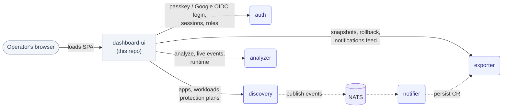

# dashboard-ui

The web dashboard of [Telark](https://github.com/telark/telark), a protection gate for your Kubernetes applications. It is where operators see their applications, run protection plans, read Insights and manage access.

This repository holds the single-page app only. It has no backend of its own: it calls the Telark services, which ship with the Telark Helm chart. To run Telark, follow the [getting started guide](https://github.com/telark/telark/blob/main/docs/getting-started.md).

## What is in the dashboard

| Area | What operators do there |
|---|---|
| Applications | Browse discovered applications and their workloads, the plans that cover them, change history and rollback, and Insights for each app |
| Protection plans | Create, schedule, approve, cancel and reactivate plans; see health, violations and reports |
| Insights | Incident cards and setup recommendations, updated live |
| Access & permissions | Users, groups, access roles and categories (environments and tags) |
| Settings | Profile, appearance, security, identity provider (Google SSO) and the local AI runtime |

Every action is gated by the signed-in user's permissions, deny rules included; the backend enforces the same checks.

Stack: React 19, TypeScript 6, Vite 8, Redux Toolkit, Ant Design 6.

## How it talks to Telark

The dashboard never reaches Kubernetes, Redis or NATS. It calls four Telark services over HTTP:

| Service | Used for |
|---|---|
| `auth` | Passkey and Google sign-in, sessions, permissions |
| `discovery` | Applications, workloads, protection-plan actions, Insights reads |
| `exporter` | Stored resources, snapshots and rollback history, notifications, categories, reports |
| `analyzer` | Analyze, live Insights events, AI runtime status and model install |



In a cluster build (`vite build --mode cluster`) the app calls `/api/<service>/api/v1/...` on its own origin, and the bundled nginx proxies those paths to the services. In local development it calls `http://localhost:<port>` directly (exporter `8002`, discovery `8004`, auth `8006`, analyzer `8007`, see `src/constants/rest/urls.ts`). All API paths live in `src/constants/rest/paths.ts` and `endpoints.ts`.

## Develop

Run the Telark services (or port-forward them to the ports above), then:

```sh
npm install
npm run dev          # http://localhost:3000
npm run check-all    # type-check and lint: run before every PR
```

| Script | Purpose |
|---|---|
| `npm run build` | Production build |
| `npm run build:cluster` | In-cluster build, used by the Dockerfile |
| `npm run build:analyze` | Build with a bundle-size report |
| `npm run serve` | Preview a build |
| `npm run lint:f`, `npm run format` | Autofix lint, format |
| `npm run check-all-and-build` | What the release pipeline runs |

Conventions, enforced by `eslint.config.mjs`:

- No `console.*` outside `src/logging/**`; use the project logger.
- Constants live in `src/constants/**` or a feature's `constants/` folder, not inline.
- Colours come only from `DEFAULT_COLORS` in `src/constants/shared/colors.ts`; colour literals elsewhere fail lint.
- No new `any`.

This repository has no CI of its own. Before a PR, run `npm run check-all`, `npm run build`, and exercise the change against real services.

## Build and release

Images and charts are built from the Telark repository, not here: [`build-ui.yaml`](https://github.com/telark/telark/blob/main/.github/workflows/build-ui.yaml) checks out this repo, runs `npm run check-all-and-build`, builds the image from this [`Dockerfile`](./Dockerfile) and signs it; [`release-charts.yaml`](https://github.com/telark/telark/blob/main/.github/workflows/release-charts.yaml) publishes the chart. See [publishing](https://github.com/telark/telark/blob/main/docs/PUBLISHING.md).

**Branching**: `<type>/<snake_case_description>`, e.g. `feat/add_auth_layer_using_webauthn`, `bug-fix/fix_apps_and_plans_bugs`, `refac/re_structure_into_features_single_link_folders`, `migrate/upgarde_to_antd_6.3.7`, `poc/integrate_vite`. Common types seen in history: `feat`, `bug-fix`, `refac`/`refacto`, `migrate`/`migration`, `poc`, `upd`.

**Commits**: short, imperative, present tense (`remove GlobalConfig Fetch on login`, `fix loading state across pages to avoid multi loaders display`). Not Conventional Commits — no enforced `feat:`/`fix:` prefix. Large multi-area commits are sometimes tagged, e.g. `[Major]: ...`, `[GAF]: ...`.

**PR checklist**: this repo has no `.github/workflows` of its own — there's no automatic per-PR CI here. The only automated check that touches this code is the `gate-ui` job in telark's [`build-ui.yaml`](../Github/telark/.github/workflows/build-ui.yaml) workflow, which — when someone builds a UI image — checks out this repo and runs `npm ci` then `npm run check-all-and-build`. Since that only runs on demand, run it yourself before opening a PR:
- [ ] `npm run check-all` passes (type-check + lint)
- [ ] `npm run build` succeeds
- [ ] Manually exercised the change against real backend services (see Local development setup)
- [ ] No new `any`, no `console.*`, no inlined literals that belong in `constants/`

## Building & Releasing

**Image builds and Helm chart releases are not managed in this repo.** They're owned by the [`telark`](https://github.com/telark/telark) repo:

- [`telark/.github/workflows/build-ui.yaml`](../Github/telark/.github/workflows/build-ui.yaml) ("Build · UI Image") checks out this repo at a given branch (default `master`), runs the `gate-ui` job (`npm run check-all-and-build`), then builds and pushes the image from this repo's [`Dockerfile`](./Dockerfile) (`node:26-alpine3.24` build stage → nginx serve stage), bumps the version, and cosign-signs it.
- [`telark/.github/workflows/release-charts.yaml`](../Github/telark/.github/workflows/release-charts.yaml) ("Release · Publish Charts") packages, pushes, and signs the `telark` and `telark-crds` Helm charts to `oci://ghcr.io/telark/charts`.
- [`telark/docs/PUBLISHING.md`](../Github/telark/docs/PUBLISHING.md) documents the manual publish path for testing a chart/image release by hand.

This repo's own `Dockerfile` only defines how the image is built; it is invoked by the telark workflow above, not by anything in this repo.

**Security headers** (`nginx/nginx.conf`): the image sets `Content-Security-Policy` (`script-src 'self'`, so no inline scripts or event handlers; `style-src` keeps `'unsafe-inline'` for antd's CSS-in-JS and allows Google Fonts), `X-Frame-Options`, `nosniff`, `Referrer-Policy` and `Permissions-Policy`, and strips `X-Service-Token`, `X-User-ID`, `X-Username` and `X-Email` from browser requests before proxying to the backends. It also answers `404` for any `/api/<service>/api/v1/internal/...` path, so service-to-service routes are never reachable from a browser. nginx serves plain HTTP on 8080, so `Strict-Transport-Security` is not set here: add it where TLS terminates (the ingress or load balancer), for example `max-age=31536000; includeSubDomains`.

(Paths above are relative to a sibling checkout — `dashboard-ui/` and `telark/` side by side. If you don't have `telark` checked out locally, the same files are at `https://github.com/telark/telark/blob/main/.github/workflows/build-ui.yaml` etc.)

## Readiness / Production docs

Installation, sizing, and verification for the full telark system (this UI included) live in the `telark` repo, not here:

- [`telark/docs/INSTALL.md`](../Github/telark/docs/INSTALL.md) — prerequisites, install-time flags, sizing modes, and the `helm test` / `kubectl get pods` verification steps.
- [`telark/docs/architecture.md`](../Github/telark/docs/architecture.md) — full system architecture, service responsibilities, and data flow (the diagram above is a UI-centric excerpt of this).
- [`telark/docs/CRDS.md`](../Github/telark/docs/CRDS.md) — the CRD groups/kinds the backend services expose, which show up as data in this UI.
- [`telark/docs/adr/`](../Github/telark/docs/adr/) — architecture decision records.

## Contributing, security and license

See [CONTRIBUTING.md](CONTRIBUTING.md), [CODE_OF_CONDUCT.md](CODE_OF_CONDUCT.md) and [GOVERNANCE.md](GOVERNANCE.md). Report vulnerabilities privately as described in [SECURITY.md](SECURITY.md). Source-available under the [Elastic License 2.0](LICENSE.md), like the rest of Telark.
